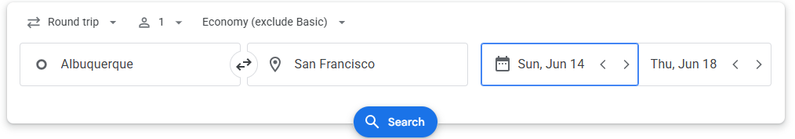
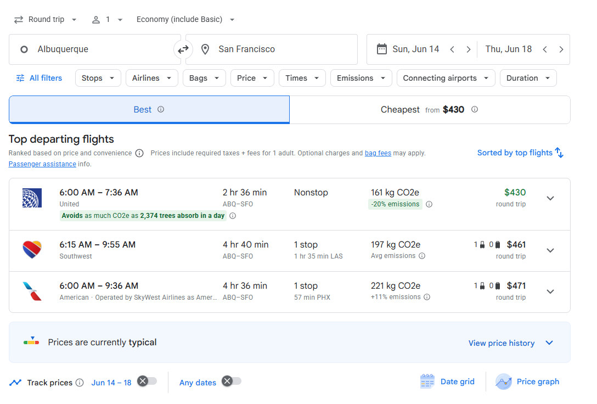
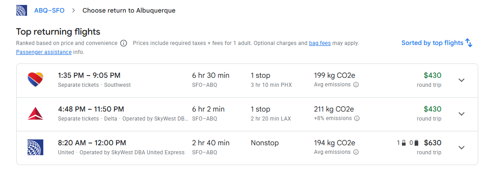
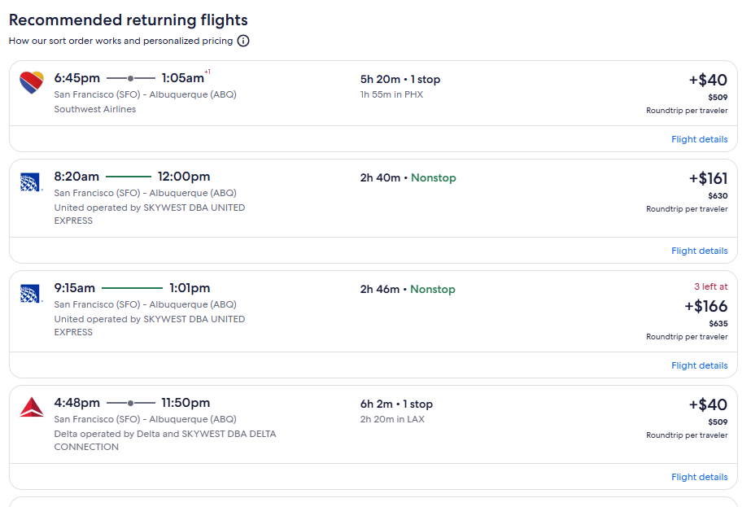

Expedia
- Initial search example

Example Search result including filters in the query parameters
https://www.expedia.com/Flights-Search?filters=%5B%7B%22preferredCabinFilterValue%22%3A%7B%22cabinCode%22%3A%22COACH%22%7D%7D%2C%7B%22seatChoiceBasedFilterValue%22%3A%7B%22seatChoice%22%3A%22SEAT_CHOICE%22%7D%7D%2C%7B%22carryOnBagBasedFilterValue%22%3A%7B%22carryOnBag%22%3A%22CARRY_ON_BAG%22%7D%7D%2C%7B%22preferredAirlineFilterValue%22%3A%7B%22carrierCode%22%3A%22WN%22%7D%7D%2C%7B%22preferredAirlineFilterValue%22%3A%7B%22carrierCode%22%3A%22UA%22%7D%7D%2C%7B%22preferredAirlineFilterValue%22%3A%7B%22carrierCode%22%3A%22DL%22%7D%7D%2C%7B%22preferredAirlineFilterValue%22%3A%7B%22carrierCode%22%3A%22AA%22%7D%7D%2C%7B%22numOfStopFilterValue%22%3A%7B%22stopInfo%22%3A%7B%22numberOfStops%22%3A0%2C%22stopFilterOperation%22%3A%22EQUAL%22%7D%7D%7D%2C%7B%22numOfStopFilterValue%22%3A%7B%22stopInfo%22%3A%7B%22numberOfStops%22%3A1%2C%22stopFilterOperation%22%3A%22EQUAL%22%7D%7D%7D%5D&leg1=from%3AAlbuquerque%2C%20NM%20%28ABQ-Albuquerque%20Intl.%20Sunport%29%2Cto%3ASan%20Francisco%2C%20CA%2C%20United%20States%20of%20America%20%28SFO-San%20Francisco%20Intl.%29%2Cdeparture%3A6%2F14%2F2026TANYT%2CfromType%3AU%2CtoType%3AA&leg2=from%3ASan%20Francisco%2C%20CA%2C%20United%20States%20of%20America%20%28SFO-San%20Francisco%20Intl.%29%2Cto%3AAlbuquerque%2C%20NM%20%28ABQ-Albuquerque%20Intl.%20Sunport%29%2Cdeparture%3A6%2F18%2F2026TANYT%2CfromType%3AA%2CtoType%3AU&mode=search&options=carrier%3A%2Ccabinclass%3A%2Cmaxhops%3A1%2Cnopenalty%3AN&passengers=adults%3A1%2Cchildren%3A0%2Cinfantinlap%3AN&trip=roundtrip

Recommended departing flights (5 max)
- lets just select all the recommended departing flights (5 max)

The main container
#app-layer-base > div.uitk-view > div:nth-child(4) > div:nth-child(1) > div > div.uitk-layout-grid-item.uitk-layout-grid-item-has-column-start-by-large.uitk-layout-grid-item-has-column-start-by-medium.uitk-layout-grid-item-has-column-start > main > div.uitk-spacing.uitk-spacing-margin-blockend-four

Click into each recommended departing flights, a popup will appear
-- popup for united. Select economy
-- popup for american. select main cabin
-- popup for southwest. select choice
-- popup for delta. select detla main classic

Modal: #AQr8AwrcA3Y1LXNvcy1kYjBmY2I5NjlhODk0N2RjYmZhZjc3ZWJhOTRlMGIzNS0yNjEyLTEtc3QtdjUtc29zLWRiMGZjYjk2OWE4OTQ3ZGNiZmFmNzdlYmE5NGUwYjM1LTI0NzItMX44LlMuMX5BUW9DQ0FFU0J3alVCQkFCR0FFb0FsZ0NjQUJ3QUhvSmJtUmpaR2x5WldOMGVnTmlabk9JQWRDaG9GLXFBUWNLQTBGQ1VSQUFzZ0VIQ2dOVFJrOFFBUX5BUW8wQ2pJSTFZSUJFZ1F4TXpZM0dLQ0FBU0N5Y1NpdzE0OERNTXpZandNNFUwQUFXQUZxQlRKZlpXTnZjZ2hUUVVFeVNrdEVUaElLQ0FFUUFSZ0JLZ0pWUVJnQklnUUlBUkFCS0FJb0F5Z0VNQXMuQVFwakNpOEkxNXdCRWdRek5qUTFHTEp4SUl1NEFTaW9pcEFETUl5TGtBTTRSVUFBV0FGcUExZEhRWElIUlV4QlYxWXlSZ293Q05lY0FSSUVNVGt4TmhpTHVBRWdvSUFCS0t5TWtBTXduNDJRQXpoRlFBRllBV29EVjBkQmNnZEZURUZYVmpKR0Vnb0lBUkFCR0FFcUFsZE9HQUVpQkFnQkVBRW9BaWdES0FRd0FREZqZmZmZSX1AIgEBKgUSAwoBMXoFQ29hY2iAAQASQwoYCgoyMDI2LTA2LTE0EgNBQlEaA1NGTzABChgKCjIwMjYtMDYtMTgSA1NGTxoDQUJROAESBxIFQ09BQ0gaAhABIAI\= > div.uitk-card.uitk-card-roundcorner-all.uitk-card-has-border.uitk-card-has-overflow.uitk-card-selected.uitk-card-has-primary-theme > div:nth-child(1) > div > div:nth-child(1) > section > div.uitk-sheet-content

Modal Cards
#AQr8AwrcA3Y1LXNvcy1kYjBmY2I5NjlhODk0N2RjYmZhZjc3ZWJhOTRlMGIzNS0yNjEyLTEtc3QtdjUtc29zLWRiMGZjYjk2OWE4OTQ3ZGNiZmFmNzdlYmE5NGUwYjM1LTI0NzItMX44LlMuMX5BUW9DQ0FFU0J3alVCQkFCR0FFb0FsZ0NjQUJ3QUhvSmJtUmpaR2x5WldOMGVnTmlabk9JQWRDaG9GLXFBUWNLQTBGQ1VSQUFzZ0VIQ2dOVFJrOFFBUX5BUW8wQ2pJSTFZSUJFZ1F4TXpZM0dLQ0FBU0N5Y1NpdzE0OERNTXpZandNNFUwQUFXQUZxQlRKZlpXTnZjZ2hUUVVFeVNrdEVUaElLQ0FFUUFSZ0JLZ0pWUVJnQklnUUlBUkFCS0FJb0F5Z0VNQXMuQVFwakNpOEkxNXdCRWdRek5qUTFHTEp4SUl1NEFTaW9pcEFETUl5TGtBTTRSVUFBV0FGcUExZEhRWElIUlV4QlYxWXlSZ293Q05lY0FSSUVNVGt4TmhpTHVBRWdvSUFCS0t5TWtBTXduNDJRQXpoRlFBRllBV29EVjBkQmNnZEZURUZYVmpKR0Vnb0lBUkFCR0FFcUFsZE9HQUVpQkFnQkVBRW9BaWdES0FRd0FREZqZmZmZSX1AIgEBKgUSAwoBMXoFQ29hY2iAAQA\= > div

Once you select a card from the modal it will route you to a new page, filters included in the query parameters
https://www.expedia.com/Flights-Search?filters=%5B%7B%22numOfStopFilterValue%22%3A%7B%22stopInfo%22%3A%7B%22numberOfStops%22%3A0%2C%22stopFilterOperation%22%3A%22EQUAL%22%7D%7D%7D%2C%7B%22numOfStopFilterValue%22%3A%7B%22stopInfo%22%3A%7B%22numberOfStops%22%3A1%2C%22stopFilterOperation%22%3A%22EQUAL%22%7D%7D%7D%2C%7B%22preferredCabinFilterValue%22%3A%7B%22cabinCode%22%3A%22COACH%22%7D%7D%2C%7B%22seatChoiceBasedFilterValue%22%3A%7B%22seatChoice%22%3A%22SEAT_CHOICE%22%7D%7D%2C%7B%22carryOnBagBasedFilterValue%22%3A%7B%22carryOnBag%22%3A%22CARRY_ON_BAG%22%7D%7D%5D&journeysContinuationId=AQqEBArkA3Y1LXNvcy1iNjFjODBlNDI4ZjQ0ZjY1OTBlM2ZjY2I5NGRhODczOC0zMjg5LTEtc3QtdjUtc29zLWI2MWM4MGU0MjhmNDRmNjU5MGUzZmNjYjk0ZGE4NzM4LTMxMzktMX44LlMuMX5BUW9DQ0FFU0J3alVCQkFCR0FFb0FsZ0NjQUJ3QUhvSmJtUmpaR2x5WldOMGVnTmlabk9JQWNhcW9GLVFBUk9RQVJPcUFRY0tBMEZDVVJBQXNnRUhDZ05UUms4UUFRfkFRbzBDaklJMVlJQkVnUXhNelkzR0tDQUFTQ3ljU2l3MTQ4RE1Nellqd000VTBBQVdBRnFCVEpmWldOdmNnaFRRVUV5U2t0RVRoSUtDQUVRQVJnQktnSlZRUmdCSWdRSUFSQUJLQUlvQXlnRU1Bcy5BUXBqQ2k4STE1d0JFZ1EwTWpNM0dMSnhJTy01QVNpemlKQURNTFdKa0FNNFJVQUFXQUZxQTFkSFFYSUhSVXhCVjFZeVJnb3dDTmVjQVJJRU1UQTFNQmp2dVFFZ29JQUJLUE9La0FNd3VZdVFBemhGUUFGWUFXb0RWMGRCY2dkRlRFRlhWakpHRWdvSUFSQUJHQUVxQWxkT0dBRWlCQWdCRUFFb0FpZ0RLQVF3QVERmpmZmZlJfUAiAQEqBRIDCgExegVDb2FjaIABABouCAESKhomOgIAAUIECgJXTkIECgJVQUIECgJETEIECgJBQUoBAFIBAKoBAQAiAA%3D%3D&leg1=from%3AAlbuquerque%2C%20NM%20%28ABQ-Albuquerque%20Intl.%20Sunport%29%2Cto%3ASan%20Francisco%2C%20CA%2C%20United%20States%20of%20America%20%28SFO-San%20Francisco%20Intl.%29%2Cdeparture%3A6%2F14%2F2026TANYT%2CfromType%3AU%2CtoType%3AA&leg2=from%3ASan%20Francisco%2C%20CA%2C%20United%20States%20of%20America%20%28SFO-San%20Francisco%20Intl.%29%2Cto%3AAlbuquerque%2C%20NM%20%28ABQ-Albuquerque%20Intl.%20Sunport%29%2Cdeparture%3A6%2F18%2F2026TANYT%2CfromType%3AA%2CtoType%3AU&mode=search&options=carrier%3A%2Ccabinclass%3A%2Cmaxhops%3A1%2Cnopenalty%3AN&pageId=1&passengers=adults%3A1%2Cchildren%3A0%2Cinfantinlap%3AN&trip=roundtrip

- lets just select all the recommended departing flights (5 max)
this is the price we want to use. 
Mark depart/return airlines and all essential details to fill in the data
