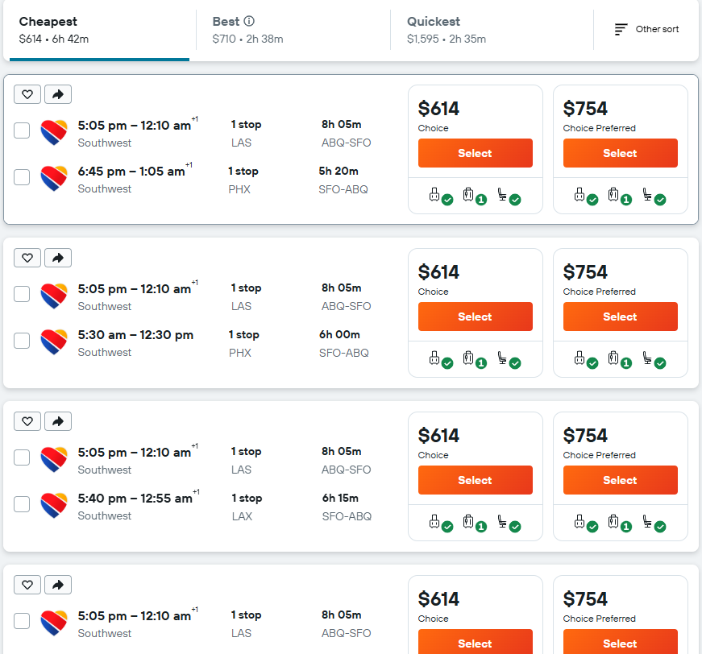
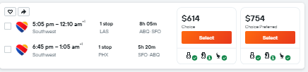

Kayak
- Initial search example
image: 

Example Search result including filters in the query parameters
https://www.kayak.com/flights/ABQ-SFO/2026-06-14/2026-06-18?ucs=1m2lzad&sort=price_a&fs=airlines%3D-AS%2Cflylocal%3Bproviders%3D-ONLY_DIRECT%2CAS%2CB6%3Bcabin%3D-f%3Bstops%3D-2%3Bbfc%3D1%3Bcfc%3D1%3Bhidebasic%3Dhidebasic

These prices on the main view already show the depart/return total prices (5 max)
- lets just select all the available flights (5 max)
image: 

The main container
selector: #flight-results-list-wrapper > div:nth-child(3) > div.Fxw9 > div

The grouped cards:
#flight-results-list-wrapper > div:nth-child(3) > div.Fxw9 > div > div:nth-child(1)

