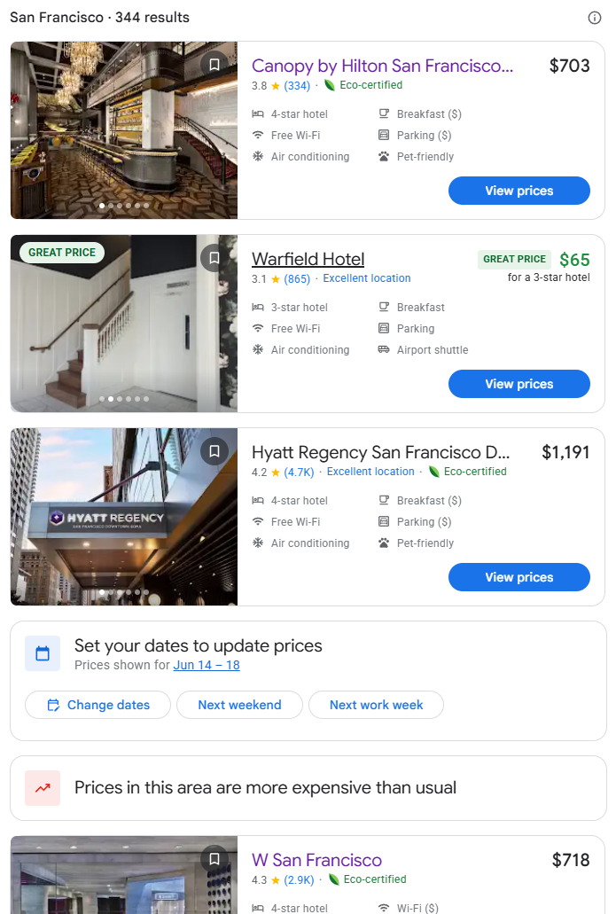
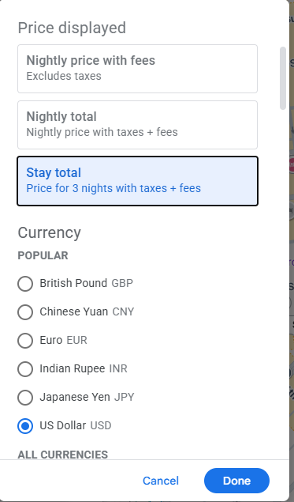
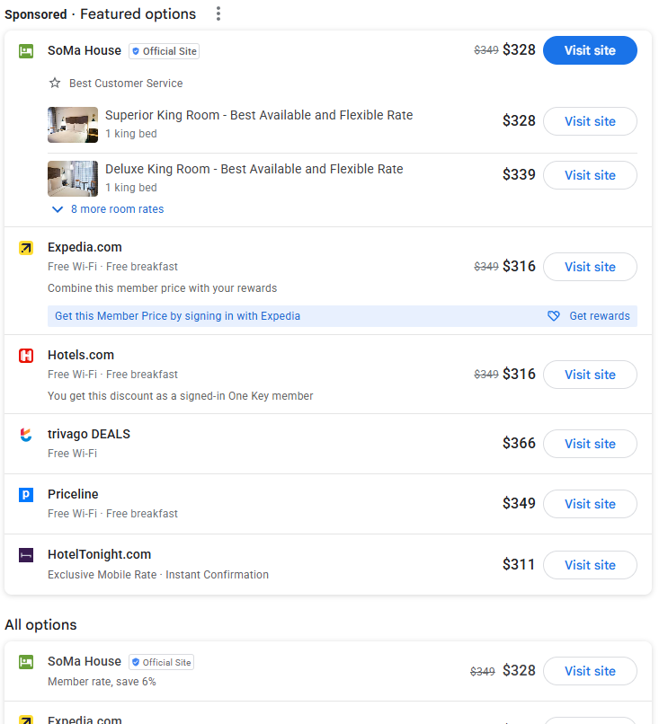

-- The site includes query paramters with specified settings.
The search bar contains the address to the Databricks AI Summit I want hotels near that area. 

site=https://www.google.com/travel/search?q=747%20Howard%20Street%2C%20San%20Francisco%2C%20CA%2094103&gsas=1&ts=CAEqCQoFOgNVU0QaAA&qs=CAAgACgASAA&ap=KigKEglz30V6G-NCQBHPu1bMn5pewBISCahzVzO65UJAEc-7VgJcmV7AMABIAboBBnByaWNlcw&sa=X&hl=en&g2lb=2502548%2C2503771%2C2503781%2C4258168%2C4284970%2C4757164%2C4814050%2C4864715%2C4874190%2C4886480%2C4893075%2C4924070%2C4965990%2C4990494%2C72266483%2C72266484%2C72298667%2C72302247%2C72317059%2C72321071%2C72332111%2C72364090&ved=0CAAQ5JsGahgKEwjoqPvOj5iUAxUAAAAAHQAAAAAQ6AQ

The search returns a list of cards


container:
/html/body/c-wiz[2]/div/c-wiz/div[1]/div[1]/div[2]/div[2]/main/c-wiz/span/c-wiz

card: 
/html/body/c-wiz[2]/div/c-wiz/div[1]/div[1]/div[2]/div[2]/main/c-wiz/span/c-wiz/c-wiz[3]/div

What I would ideally like to do is click into the top 8 cards to view prices
#id > c-wiz > c-wiz:nth-child(5) > div > div > div > div.kCsInf.ZJqrAd.qiy8jf > div > div.eDlCVd.kUqfed > div.XKB4Sc.Pf7YId > div > a > button

it will route yo to a page similar to this link:
https://www.google.com/travel/search?q=747%20Howard%20Street%2C%20San%20Francisco%2C%20CA%2094103&gsas=1&ts=CAESCgoCCAMKAggDEAAaMQoTEg8KDS9nLzExZ3IzNmhobnQaABIaEhQKBwjqDxAGGA8SBwjqDxAGGBIYAzICCAIqDQoFOgNVU0QaACICGAE&qs=CAEgACgAMidDaGtJemViaTRlVDV1WTlvR2cwdlp5OHhNWFl6ZW5aNE1UQTNFQUU4DUgA&ap=KigKEglz30V6G-NCQBHPu1a8kZpewBISCahzVzO65UJAEc-7VhJqmV7AMABIAboBBnByaWNlcw&sa=X&hl=en&g2lb=2502548%2C2503771%2C2503781%2C4258168%2C4284970%2C4757164%2C4814050%2C4864715%2C4874190%2C4886480%2C4893075%2C4924070%2C4965990%2C4990494%2C72266483%2C72266484%2C72298667%2C72302247%2C72317059%2C72321071%2C72332111%2C72364090&ved=0CAAQ5JsGahgKEwjoqPvOj5iUAxUAAAAAHQAAAAAQjgg


There is a drop down to change the price displayed. Let's change it to Stay Total
Here is the new URL slug in case that actually gets appended to the url
https://www.google.com/travel/search?q=747%20Howard%20Street%2C%20San%20Francisco%2C%20CA%2094103&gsas=1&ts=CAESCgoCCAMKAggDEAAaMQoTEg8KDS9nLzExZ3IzNmhobnQaABIaEhQKBwjqDxAGGA8SBwjqDxAGGBIYAzICCAIqDQoFOgNVU0QaACICGAE&qs=CAEgACgAMidDaGtJemViaTRlVDV1WTlvR2cwdlp5OHhNWFl6ZW5aNE1UQTNFQUU4DUgA&ap=KigKEglz30V6G-NCQBHPu1a8kZpewBISCahzVzO65UJAEc-7VhJqmV7AMABIAboBBnByaWNlcw&sa=X&hl=en&g2lb=2502548%2C2503771%2C2503781%2C4258168%2C4284970%2C4757164%2C4814050%2C4864715%2C4874190%2C4886480%2C4893075%2C4924070%2C4965990%2C4990494%2C72266483%2C72266484%2C72298667%2C72302247%2C72317059%2C72321071%2C72332111%2C72364090&ved=0CAAQ5JsGahgKEwjoqPvOj5iUAxUAAAAAHQAAAAAQjgg

Otherwise here is the modal: #yDmH0d > div.llhEMd.iWO5td > div > div.g3VIld.Fqio0e.CpaX6.Up8vH.J9Nfi.iWO5td



This is the main container for the options:
#prices > c-wiz.K1smNd > c-wiz.tuyxUe > div > section > div.A5WLXb.q3c9pf.lEjuQe > c-wiz > div

Ignore the "Sponsored options"


Select all the price options for this hotel.
This is an example of a card
#prices > c-wiz.K1smNd > c-wiz.tuyxUe > div > section > div.A5WLXb.q3c9pf.lEjuQe > c-wiz > div > div > div.R09YGb.WCYWbc > div.vxYgIc.fLiu5d > span > div:nth-child(1)


Write results to a csv with a similar column structure as the flights travel plan showing all relevant details including
- trip=databricks ai summit, search=747 howard street, hotel="", check-in=date, checkin-time, check-out=date, checkout-time, cost per night, total cost, fee's, ammentities, rating.. ect.

---

## Implementation findings (2026-05-01)

### What works
- Direct `?q=<address>` URL bypasses the homepage form (no need to click into search box).
- Hotel card detail navigation works via `card.querySelector('a[href*="/travel/"]').href` + `page.goto(href)`.
  - Programmatic `el.click()` is **ignored** by Google's jsaction handlers — synthetic clicks are filtered out everywhere on this page.
- Stay Total **dropdown trigger** is reliably located via structural CSS selector (XPath indices vary per hotel):
  - `section span > span > span > button` (filtered to one whose text matches `/night|total|stay/i`)
  - User-confirmed XPath samples (different across hotels): `.../span[1]/c-wiz[1]/c-wiz[3]/.../button` and `.../span[2]/c-wiz[1]/c-wiz[1]/.../button` — same shape, different indices.
  - Clicking via Playwright `locator.click()` (real mouse) DOES open the modal.
- Modal opens as a portal-mounted dialog at `body > div[N]` (typically `div[7]`) with TWO `[role="dialog"]` wrappers.
- Modal contains 3 price-display labels followed by ~78 currency labels:
  - `label[0]`: "Nightly price with fees Excludes taxes"
  - `label[1]`: "Nightly total Nightly price with taxes + fees"
  - `label[2]`: "Stay total Price for N nights with taxes + fees" ← what we want
- Done button (commits the modal): `body > div > div > div > div > div > button` filtered to text `Done`.

### Breakthrough — Stay Total dropdown is a red herring
Tried every click strategy on the "Stay total" `<label>`:
- Inner `<span>` click via Playwright `force: true`
- `page.mouse.click(x, y)` on label bounding-box center
- Modal trigger ("Nightly price with fees" button) opens correctly + Done click commits

**Prices in `#prices` never change.** Sampled `#prices[1].textContent` before / after-inner-span-click / after-mouse-xy-click / after-done — all identical: `$83 $97 $388 $89 $104 ...`.

**Why the click "doesn't work":** It actually does — but the dropdown only changes which dollar value is *visually highlighted*. The DOM **always contains all three values per row** for every option:

```
Expedia.com $83 $97 $388 Visit site
Standard Room ... $83 $97 $388 Visit site
Standard Room ... $89 $104 $416 Visit site
Standard Room ... $111 $131 $523 Visit site
```

- `$83` = nightly base (no fees)
- `$97` = nightly with taxes & fees (= $83 + ~$14)
- `$388` = stay total (= $97 × 4 nights) ← what we want

So the modal switch is **not needed**. We can extract the stay total directly via the triple-dollar pattern.

### Other gotchas worth remembering
- There are **TWO `#prices` elements on the page** (Google reuses the id):
  - `#prices[0]` = title heading ("Prices", 6 chars textContent)
  - `#prices[1]` = the actual data section (~12k chars textContent)
  - Use `document.querySelectorAll('#prices')[1]` to reach the data.
- `#prices.innerText` returns 6 chars (only the heading is rendered text). `textContent` correctly returns descendant text including all dollar values.
- `<label>` elements in the modal have `role="presentation"` + `jslog="...;track:click"` — pure custom Google components, no native `<input type="radio">`. Clicks fire jsaction but only update visual highlighting in this case.

### Final scraping approach
1. Navigate to hotel detail page via the SERP card's `<a href>`.
2. Wait for `#prices` to populate (poll `querySelectorAll('*')` for `$NNN` text).
3. Read `document.querySelectorAll('#prices')[1].textContent`.
4. Match `(?:^|Visit site)([^$]*?)\$([\d,]+)\s*\$([\d,]+)\s*\$([\d,]+)/g` — the third capture group is the stay total.
5. Look up provider in the `preceding` text against `KNOWN_SOURCES`; default to "Hotel direct".
6. Filter implausible totals (`< nights × $40`).
7. Take 3 cheapest unique totals per hotel.

Throws ~20-65 valid rows per hotel, takes ~25s per hotel including page load.

### Stable selectors (current code)
| Purpose | Selector |
|---|---|
| Hotel card link | `main c-wiz span c-wiz > c-wiz` then `.querySelector('a[href*="/travel/"]')` |
| Price-display dropdown trigger | `section span > span > span > button` (filter: `/night\|total\|stay/i`) |
| Stay-total option label | `label` filtered by `^Stay total/i` |
| Done button | `body > div > div > div > div > div > button` filter `^Done$` |
| Price option scrape (fallback chain) | `#prices section c-wiz`, then `#prices section`, then `#prices` |